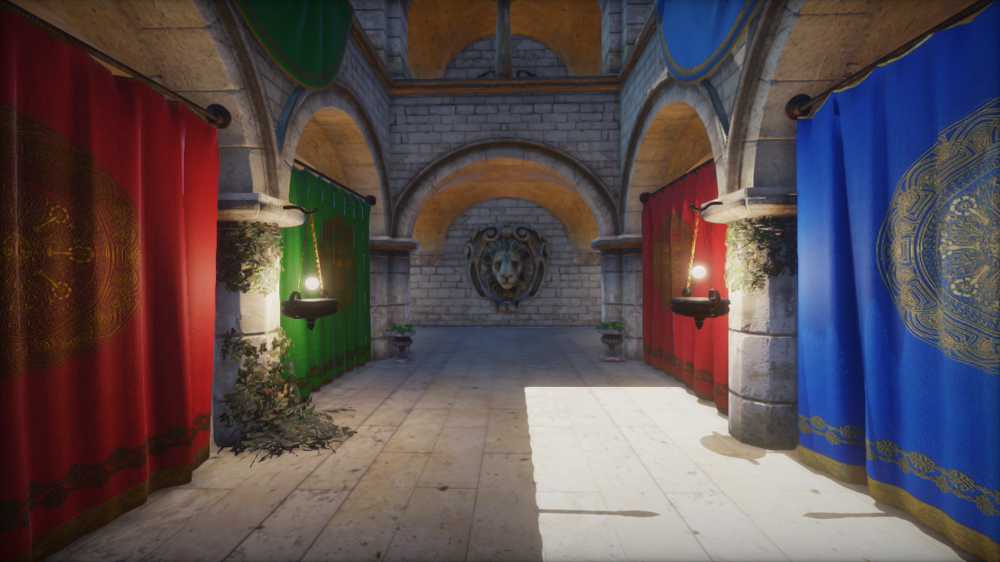
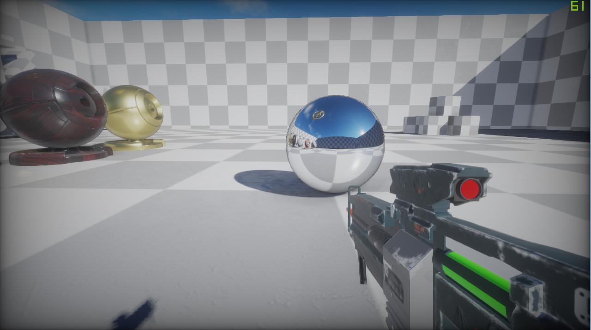

# Crucible

An OpenGL base game engine created for educational purposes. Some features of the engine are:

* Full PBR shader support
* Deferred and forward rendering pipelines
* Transparent object and custom unlit shader support for forward rendering
* Queue based rendering architecture with draw calls being submitted to the queue
* Runtime-Baked global illumination using light probes
* Cascaded shadow mapping with multiple filtering modes
* Post processing stack support, with built in shaders for tonemapping, ambient occlusion, bloom, FXAA, and experimental screen space reflections.
* Scene rendering with physics using the Bullet Physics library
* Easy to use custom vector math library with built in operator support
* Loading Material definitions from disk using a JSON based file format
* A Resource manager for avoiding loading duplicate resources
* 3D Model loading using the Assimp library

### Examples

